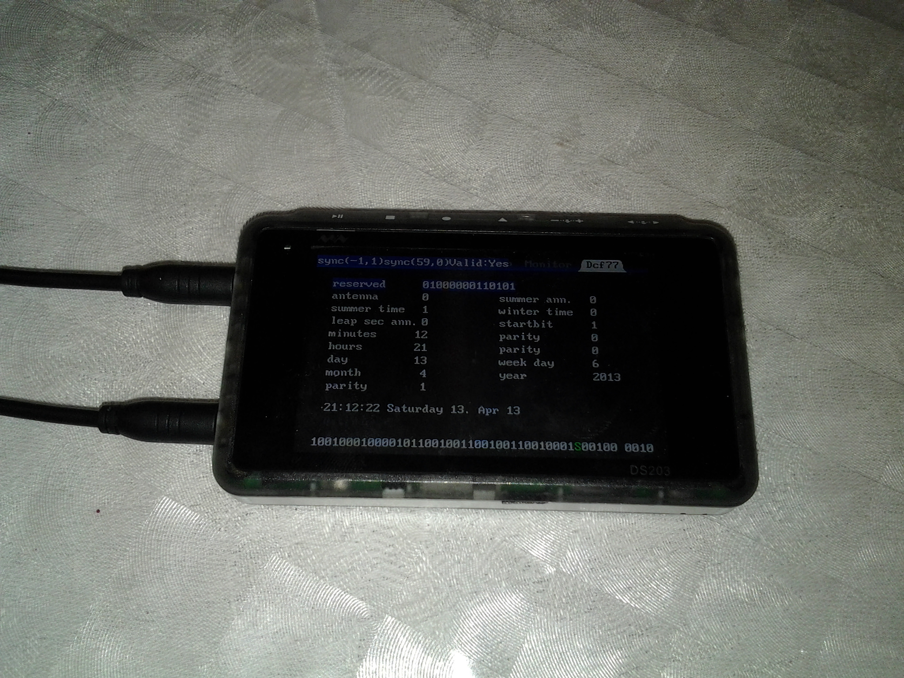
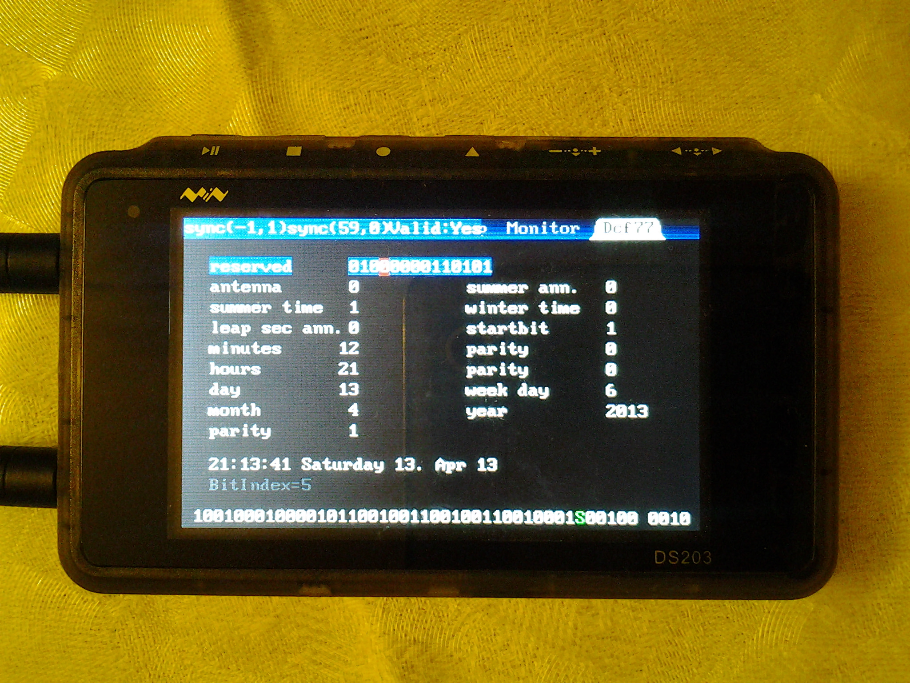
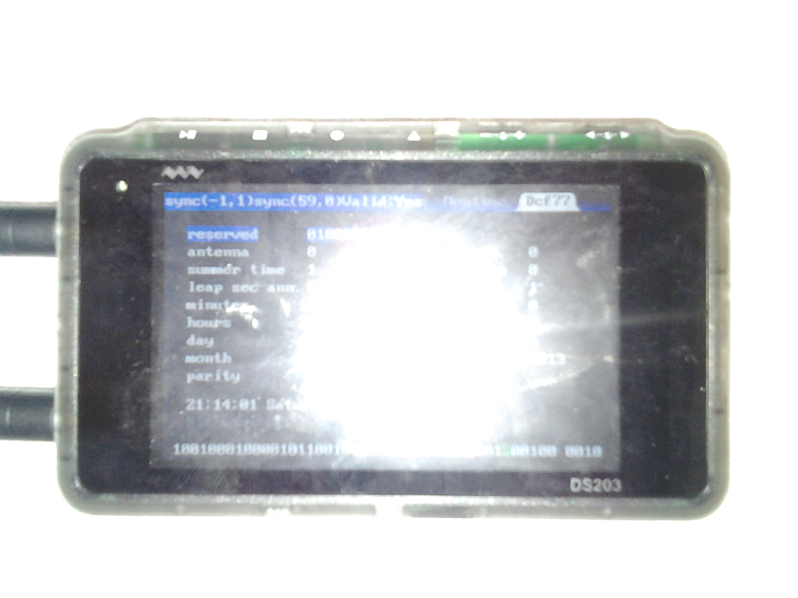
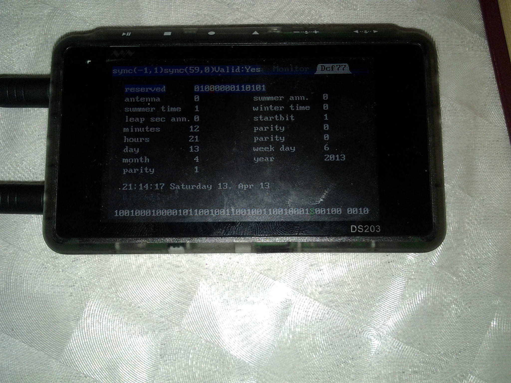
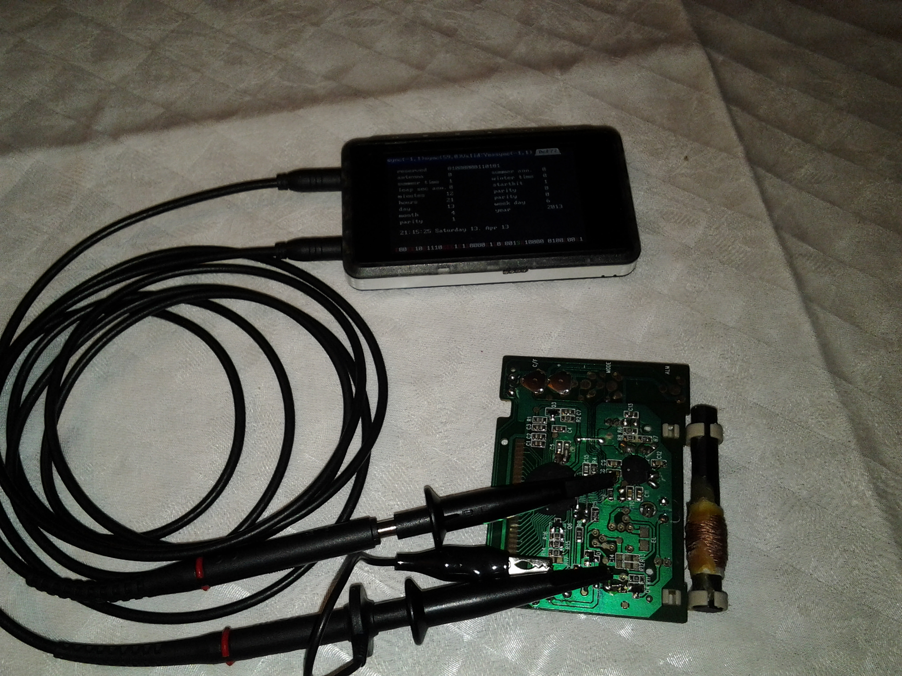
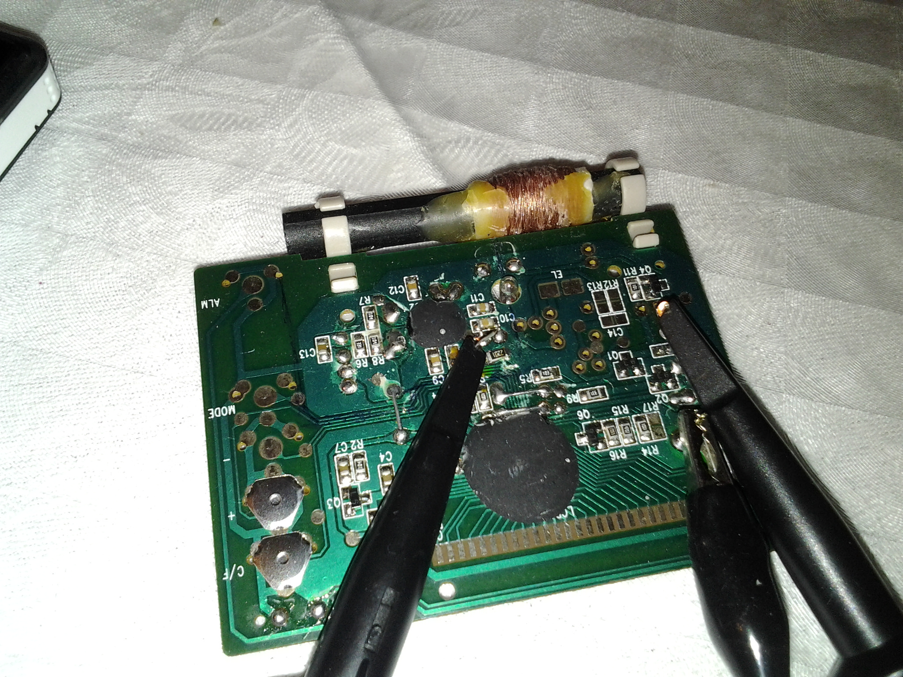
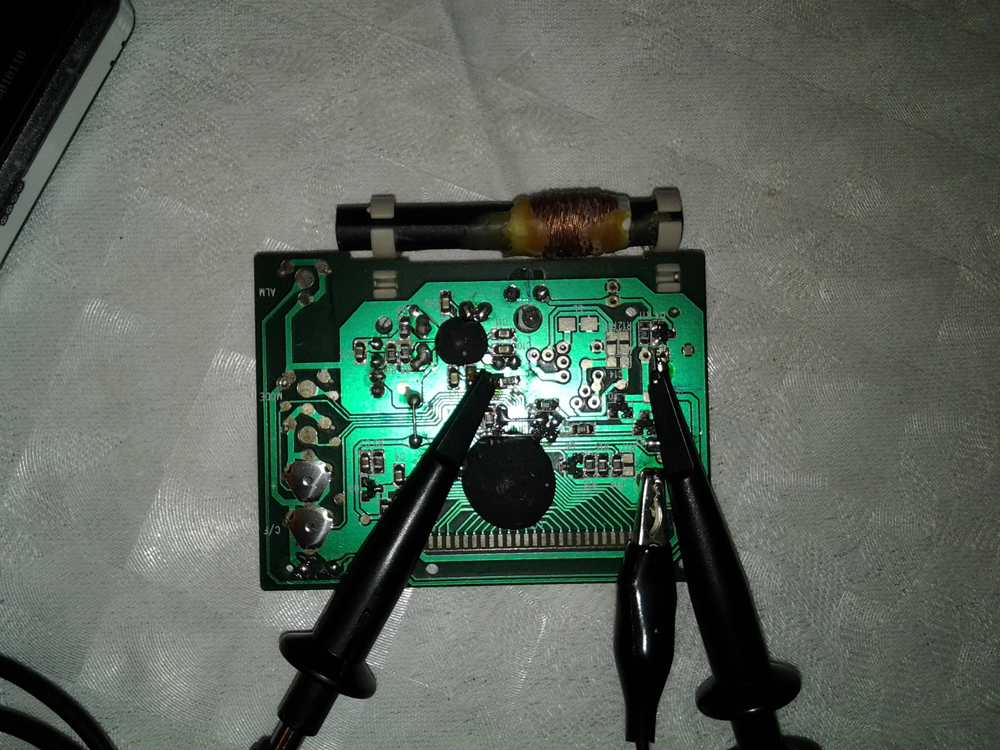
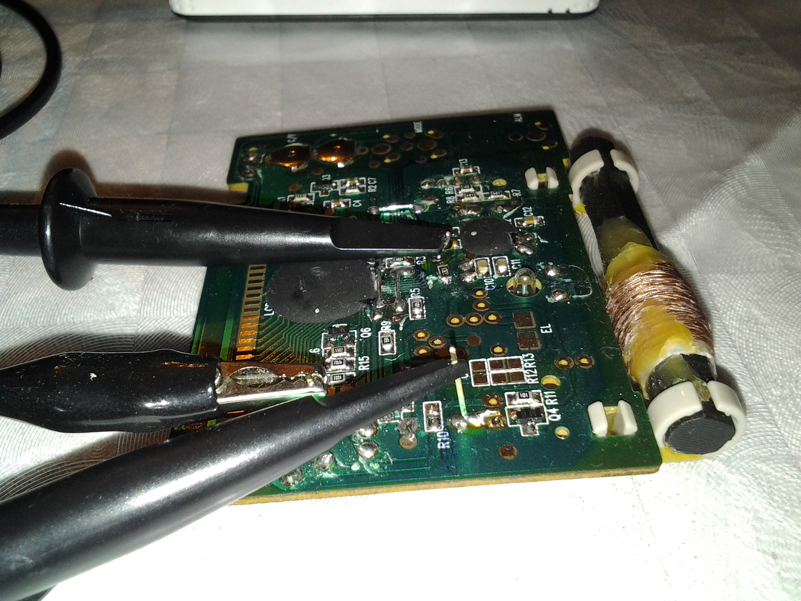

Decoding the DCF77 frames
---------------------------

A friend of mine gave me old bronken radio controlled digital clock. On the PCB there are two integrated circuits - the larger black blob is the clock microcontroller, the smaller is the DCF77 receiver. They are connected through two wires, one of the wires transfers the demodulated signal into main microcontroller and the second is chip select. The clock turns on the DCF module right after power up and after some time or successfull reconstruction of DCF frame turns the module off... So I have done a little modification - the chip select is always tied to GND through 2kOhm resistor and I cut the track leading to microcontroller. The clock drains a very small current, thus it can be powered directly from the DSO WaveOut by setting the signal generator to give 1.5V DC output. The timebase should be set to fastest possible rate, the scan mode enabled and the trigger level set between log.0 and log.1 of the DCF demodulated signal.

Photos
------------------

