Reading electricity meter
---------------------------

Photo-resistor is placed in front of LED diode signalling the power consumption. 1600 impulses corresponds to 1kWh. DSO203 is used for powering the resistor divider (photo resistor with 27kOhm resistor in series) and for processing the voltage from the divider for identification of the impulses. DSO User app displays the total consumed energy in kWh as such as the current consuption in kW.
The aim of this project was to design a simple non-invasive energy consumption meter. The power meter device is a property of energy distribution company, so no modifications or disassembling is possible. The only modification was fixing a plastic nut with silicone on the plastic casing of the meter. Silicone is strong enough to hold the sensor firmly on it's place while it can be easily removed without damaging the plastic casing.
It was hard to find such large plastic nuts and screws, the one I used are sold under the name "plastic toilet seat screws" :) Before fixing the nut on the box, I used a bench grinder to make it smaller and to make it's top flat. The sensor with 4pin RJ connector are placed on a small piece of plexi glass. To reduce the interference of the outer light on the reading, the photo resistor is inside a black heat shrinking tube. The signals on the connector are following: 1. ground, 2. VCC, 3. signal

Experiments
------------------
Comparing the response of photo diode and photo resistor to modulated light. 
<!-- http://htmlpreview.github.io/?https://raw.github.com/gabonator/DS203/blob/master/Resources/Projects/ElectricityMeter/meas.html -->
http://pub.valky.eu/emetermeas

User interface
------------------
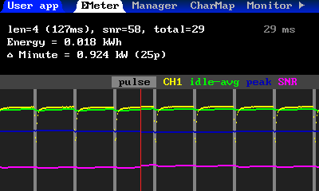

Photos
------------------

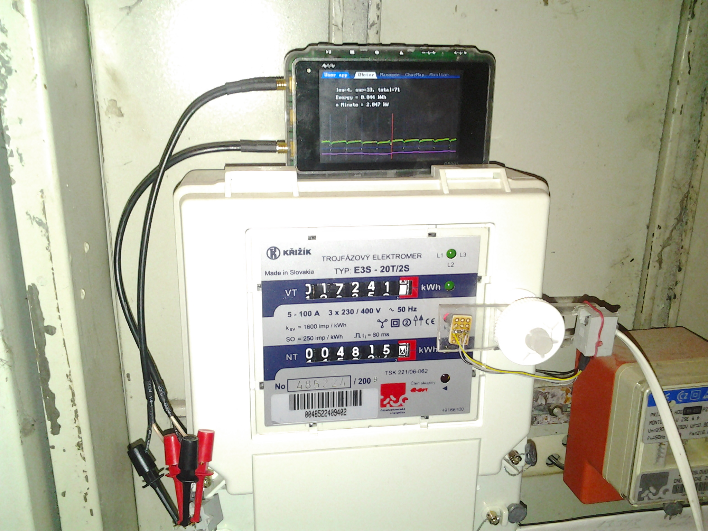
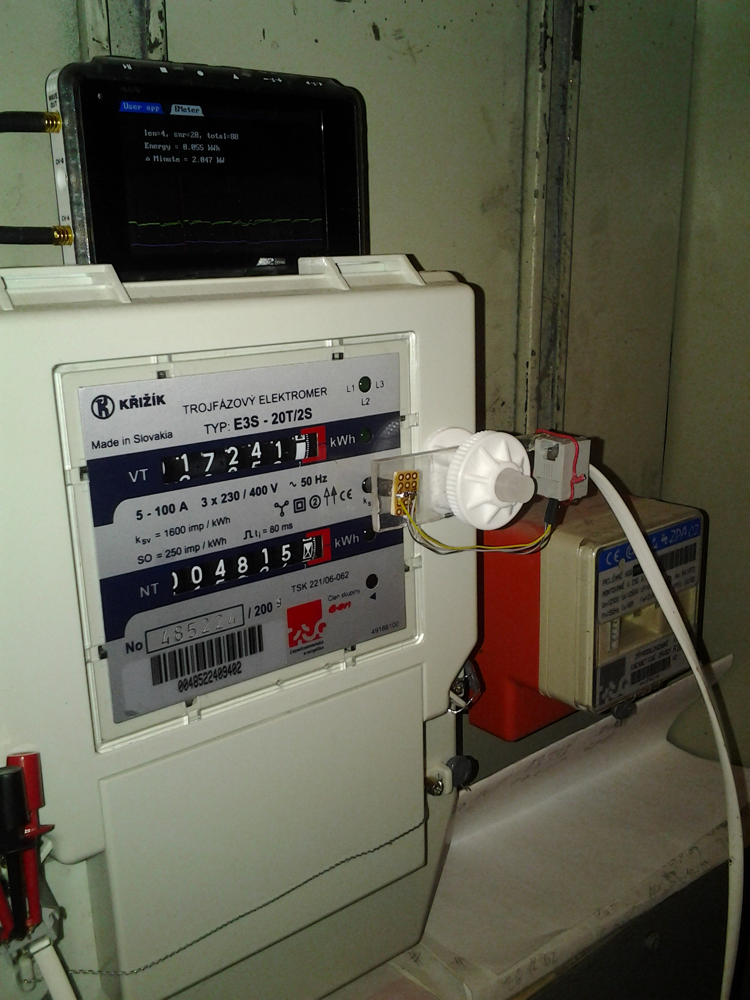
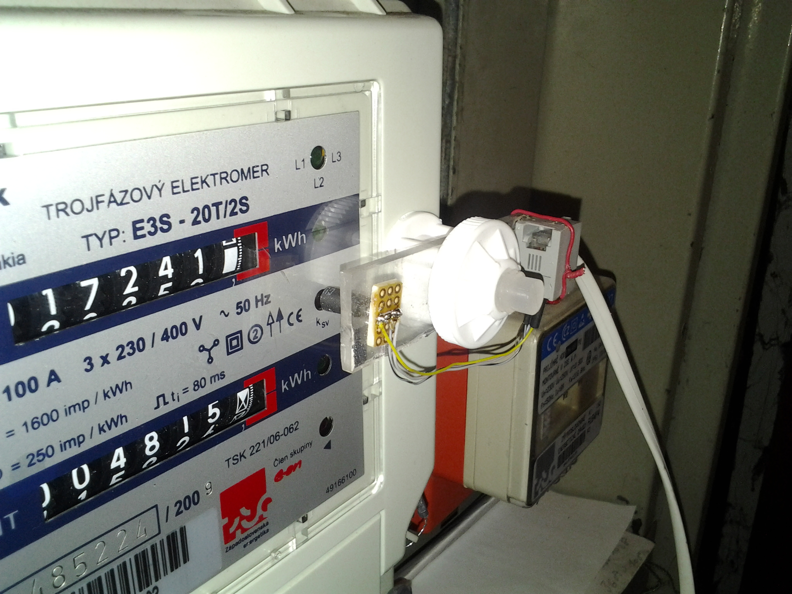
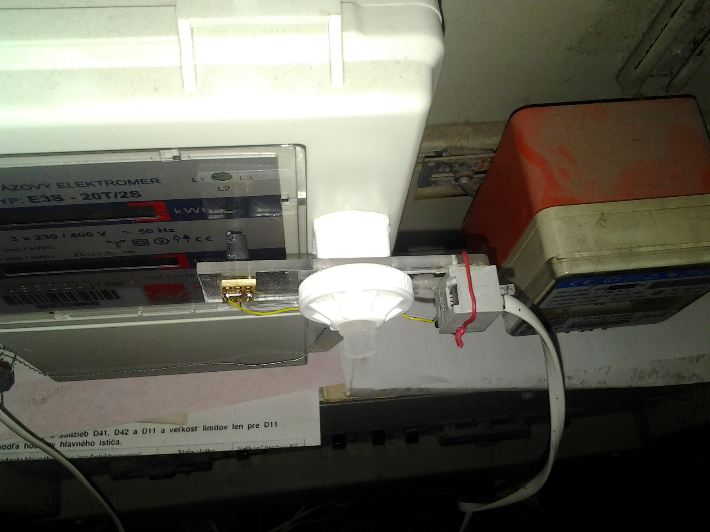
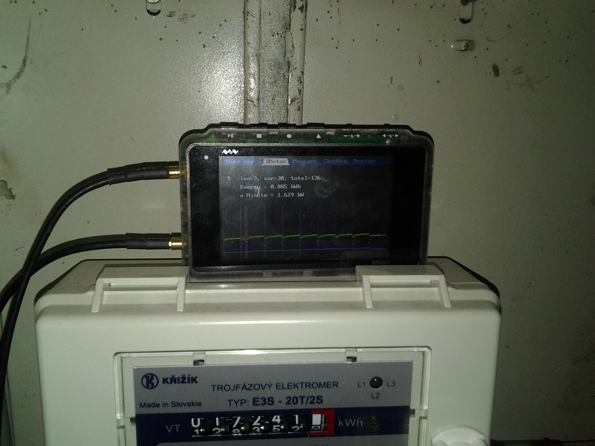

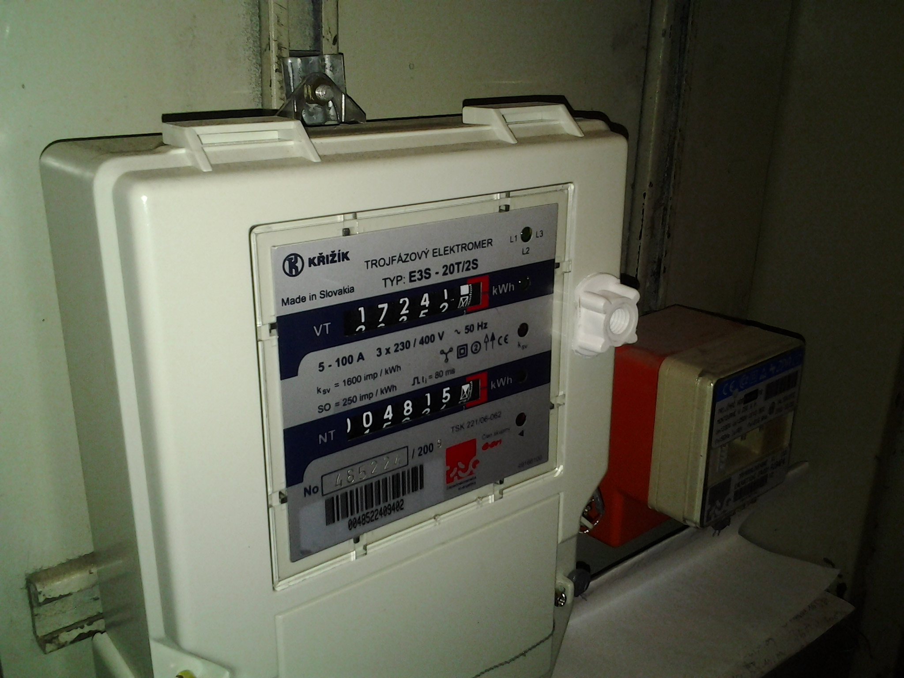
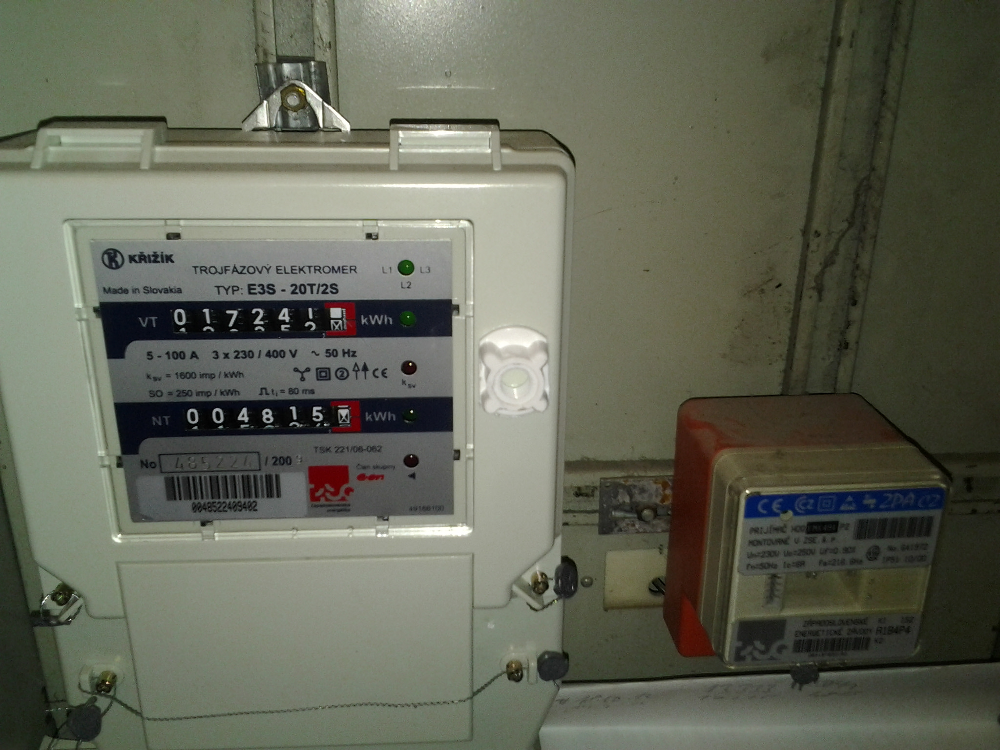
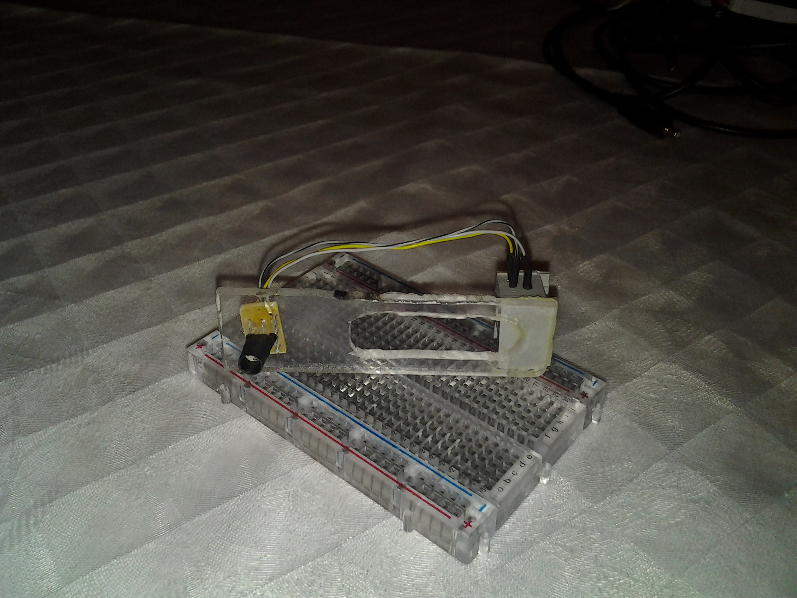
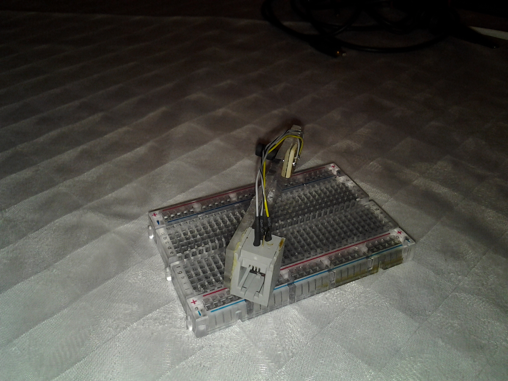
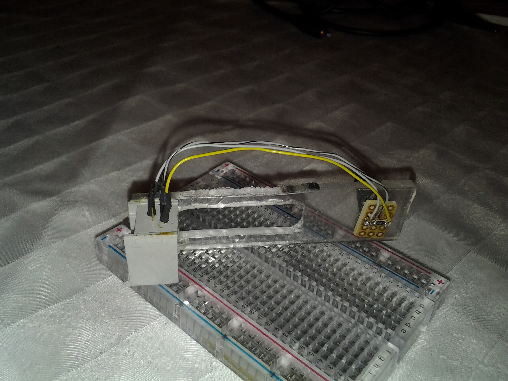

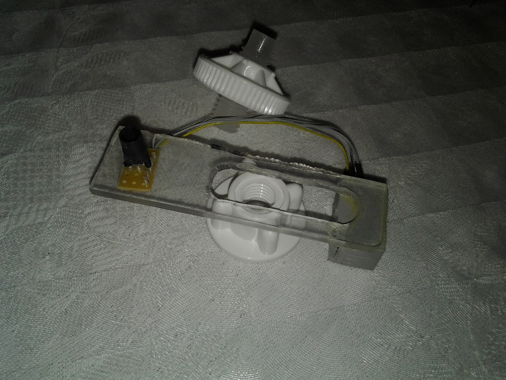

